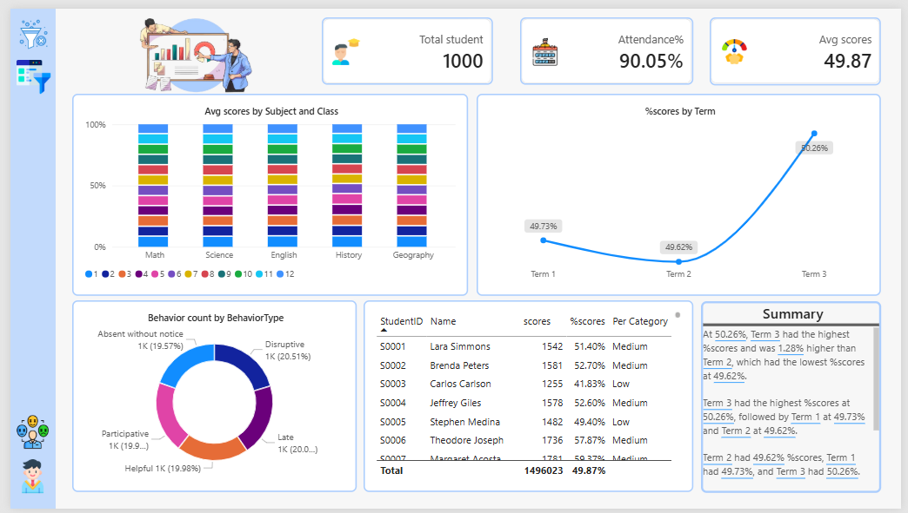
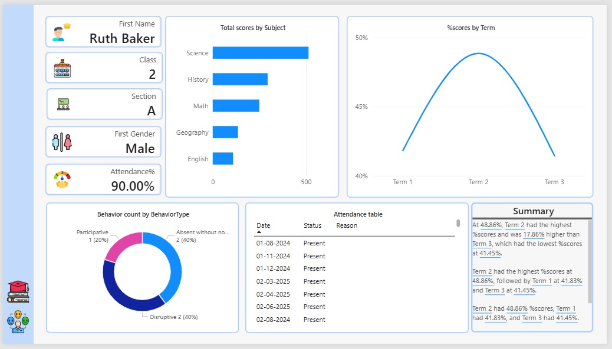

# 🎓 Student Performance Dashboard (Power BI)

## 📌 Project Overview

This project is a Power BI dashboard that analyzes student academic performance, attendance, and behavior.

---

## 📊 Dashboard Pages

### 1. Academic Dashboard

* Average Score by Subject
* Performance Trend by Term
* Attendance %
* KPI Cards

### 2. Behavioral Dashboard

* Behavior Type Distribution
* Good vs Bad Behavior Analysis
* Behavior Trends

### 3. Student Drillthrough

* Individual Student Performance
* Attendance Details
* Behavior Records

---

## 📂 Dataset

* Students.xlsx
* Scores.xlsx
* Attendance.xlsx
* Behavior.xlsx

---

## 📈 Key Insights

* Students with low attendance have lower scores
* Some subjects have lower average performance
* Negative behavior impacts academic results

---

## 🛠 Tools Used

* Power BI
* DAX
* Data Modeling

---

## 📸 Dashboard Preview

### Academic Dashboard

### Behavioral Dashboard

### Student Drillthrough

---

## 📄 Documentation

See full documentation in PDF file.

---

## 👨‍💻 Author

Mayur Makwana
